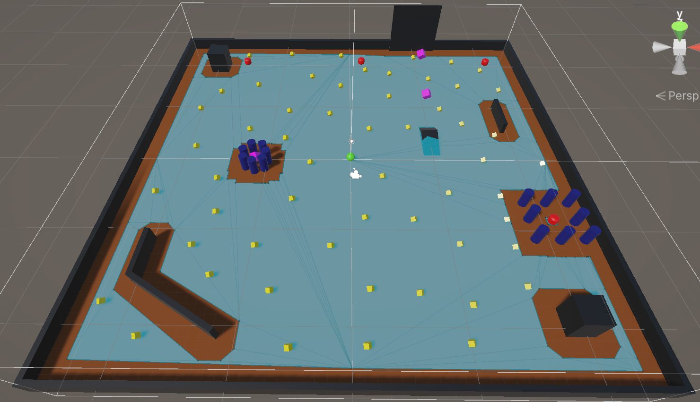
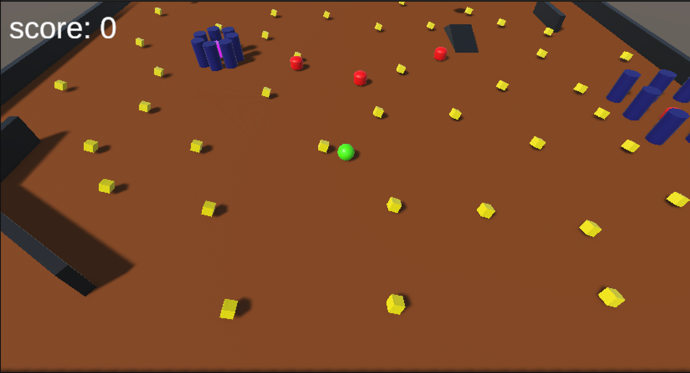

# Roll a Ball - Unity Game

## Features
- Player movement using Rigidbody
- Enemy AI chasing player (NavMeshAgent)
- Collectible Pickups
- Score counter UI
- Win condition 
- Lose condition (Enemy collision / Falling from the ground)

## Technologies
- C#
- Unity
- TextMeshPro
- NavMesh Navigation

## How to Play
- Move the player using WASD / Arrow keys
- Collect all pickups to win
- Avoid the enemy

## What I Learned
- Rigidbody movement
- Collision & Trigger systems
- NavMeshAgent AI movement
- UI with TextMeshPro
- Prefabs and GameObjects

## Screenshots

## Author
Nika Shekiladze
